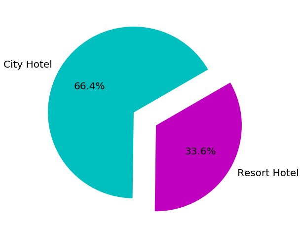
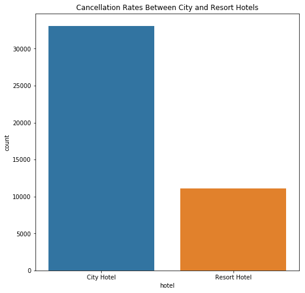
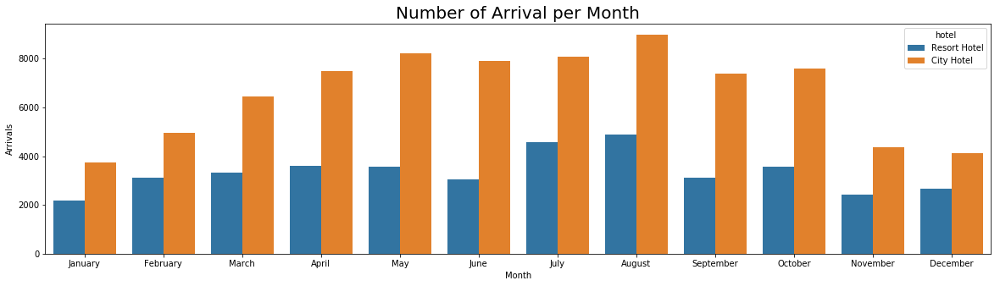
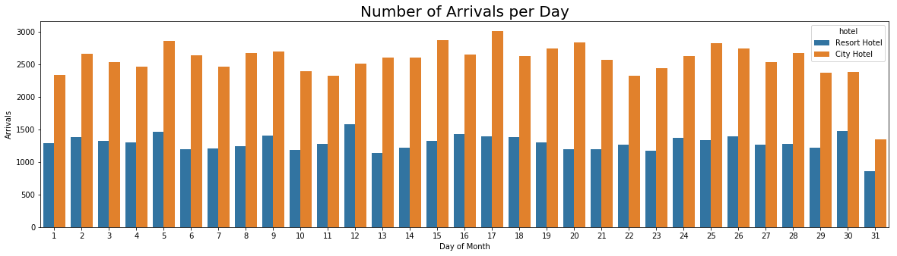

### Import Required Packages


```python
import pandas as pd
import numpy as np
import matplotlib.pyplot as plt
import seaborn as sns
```

### Read the CSV & Examine the Data


```python
data = pd.read_csv("/users/Gavin/Desktop/hotel_bookings.csv")
```


```python
data.head()
```


<div>
<style scoped>
    .dataframe tbody tr th:only-of-type {
        vertical-align: middle;
    }

    .dataframe tbody tr th {
        vertical-align: top;
    }

    .dataframe thead th {
        text-align: right;
    }
</style>
<table border="1" class="dataframe">
  <thead>
    <tr style="text-align: right;">
      <th></th>
      <th>hotel</th>
      <th>is_canceled</th>
      <th>lead_time</th>
      <th>arrival_date_year</th>
      <th>arrival_date_month</th>
      <th>arrival_date_week_number</th>
      <th>arrival_date_day_of_month</th>
      <th>stays_in_weekend_nights</th>
      <th>stays_in_week_nights</th>
      <th>adults</th>
      <th>...</th>
      <th>deposit_type</th>
      <th>agent</th>
      <th>company</th>
      <th>days_in_waiting_list</th>
      <th>customer_type</th>
      <th>adr</th>
      <th>required_car_parking_spaces</th>
      <th>total_of_special_requests</th>
      <th>reservation_status</th>
      <th>reservation_status_date</th>
    </tr>
  </thead>
  <tbody>
    <tr>
      <th>0</th>
      <td>Resort Hotel</td>
      <td>0</td>
      <td>342</td>
      <td>2015</td>
      <td>July</td>
      <td>27</td>
      <td>1</td>
      <td>0</td>
      <td>0</td>
      <td>2</td>
      <td>...</td>
      <td>No Deposit</td>
      <td>NaN</td>
      <td>NaN</td>
      <td>0</td>
      <td>Transient</td>
      <td>0.0</td>
      <td>0</td>
      <td>0</td>
      <td>Check-Out</td>
      <td>2015-07-01</td>
    </tr>
    <tr>
      <th>1</th>
      <td>Resort Hotel</td>
      <td>0</td>
      <td>737</td>
      <td>2015</td>
      <td>July</td>
      <td>27</td>
      <td>1</td>
      <td>0</td>
      <td>0</td>
      <td>2</td>
      <td>...</td>
      <td>No Deposit</td>
      <td>NaN</td>
      <td>NaN</td>
      <td>0</td>
      <td>Transient</td>
      <td>0.0</td>
      <td>0</td>
      <td>0</td>
      <td>Check-Out</td>
      <td>2015-07-01</td>
    </tr>
    <tr>
      <th>2</th>
      <td>Resort Hotel</td>
      <td>0</td>
      <td>7</td>
      <td>2015</td>
      <td>July</td>
      <td>27</td>
      <td>1</td>
      <td>0</td>
      <td>1</td>
      <td>1</td>
      <td>...</td>
      <td>No Deposit</td>
      <td>NaN</td>
      <td>NaN</td>
      <td>0</td>
      <td>Transient</td>
      <td>75.0</td>
      <td>0</td>
      <td>0</td>
      <td>Check-Out</td>
      <td>2015-07-02</td>
    </tr>
    <tr>
      <th>3</th>
      <td>Resort Hotel</td>
      <td>0</td>
      <td>13</td>
      <td>2015</td>
      <td>July</td>
      <td>27</td>
      <td>1</td>
      <td>0</td>
      <td>1</td>
      <td>1</td>
      <td>...</td>
      <td>No Deposit</td>
      <td>304.0</td>
      <td>NaN</td>
      <td>0</td>
      <td>Transient</td>
      <td>75.0</td>
      <td>0</td>
      <td>0</td>
      <td>Check-Out</td>
      <td>2015-07-02</td>
    </tr>
    <tr>
      <th>4</th>
      <td>Resort Hotel</td>
      <td>0</td>
      <td>14</td>
      <td>2015</td>
      <td>July</td>
      <td>27</td>
      <td>1</td>
      <td>0</td>
      <td>2</td>
      <td>2</td>
      <td>...</td>
      <td>No Deposit</td>
      <td>240.0</td>
      <td>NaN</td>
      <td>0</td>
      <td>Transient</td>
      <td>98.0</td>
      <td>0</td>
      <td>1</td>
      <td>Check-Out</td>
      <td>2015-07-03</td>
    </tr>
  </tbody>
</table>
<p>5 rows × 32 columns</p>
</div>


```python
data.tail()
```


<div>
<style scoped>
    .dataframe tbody tr th:only-of-type {
        vertical-align: middle;
    }

    .dataframe tbody tr th {
        vertical-align: top;
    }

    .dataframe thead th {
        text-align: right;
    }
</style>
<table border="1" class="dataframe">
  <thead>
    <tr style="text-align: right;">
      <th></th>
      <th>hotel</th>
      <th>is_canceled</th>
      <th>lead_time</th>
      <th>arrival_date_year</th>
      <th>arrival_date_month</th>
      <th>arrival_date_week_number</th>
      <th>arrival_date_day_of_month</th>
      <th>stays_in_weekend_nights</th>
      <th>stays_in_week_nights</th>
      <th>adults</th>
      <th>...</th>
      <th>deposit_type</th>
      <th>agent</th>
      <th>company</th>
      <th>days_in_waiting_list</th>
      <th>customer_type</th>
      <th>adr</th>
      <th>required_car_parking_spaces</th>
      <th>total_of_special_requests</th>
      <th>reservation_status</th>
      <th>reservation_status_date</th>
    </tr>
  </thead>
  <tbody>
    <tr>
      <th>119385</th>
      <td>City Hotel</td>
      <td>0</td>
      <td>23</td>
      <td>2017</td>
      <td>August</td>
      <td>35</td>
      <td>30</td>
      <td>2</td>
      <td>5</td>
      <td>2</td>
      <td>...</td>
      <td>No Deposit</td>
      <td>394.0</td>
      <td>NaN</td>
      <td>0</td>
      <td>Transient</td>
      <td>96.14</td>
      <td>0</td>
      <td>0</td>
      <td>Check-Out</td>
      <td>2017-09-06</td>
    </tr>
    <tr>
      <th>119386</th>
      <td>City Hotel</td>
      <td>0</td>
      <td>102</td>
      <td>2017</td>
      <td>August</td>
      <td>35</td>
      <td>31</td>
      <td>2</td>
      <td>5</td>
      <td>3</td>
      <td>...</td>
      <td>No Deposit</td>
      <td>9.0</td>
      <td>NaN</td>
      <td>0</td>
      <td>Transient</td>
      <td>225.43</td>
      <td>0</td>
      <td>2</td>
      <td>Check-Out</td>
      <td>2017-09-07</td>
    </tr>
    <tr>
      <th>119387</th>
      <td>City Hotel</td>
      <td>0</td>
      <td>34</td>
      <td>2017</td>
      <td>August</td>
      <td>35</td>
      <td>31</td>
      <td>2</td>
      <td>5</td>
      <td>2</td>
      <td>...</td>
      <td>No Deposit</td>
      <td>9.0</td>
      <td>NaN</td>
      <td>0</td>
      <td>Transient</td>
      <td>157.71</td>
      <td>0</td>
      <td>4</td>
      <td>Check-Out</td>
      <td>2017-09-07</td>
    </tr>
    <tr>
      <th>119388</th>
      <td>City Hotel</td>
      <td>0</td>
      <td>109</td>
      <td>2017</td>
      <td>August</td>
      <td>35</td>
      <td>31</td>
      <td>2</td>
      <td>5</td>
      <td>2</td>
      <td>...</td>
      <td>No Deposit</td>
      <td>89.0</td>
      <td>NaN</td>
      <td>0</td>
      <td>Transient</td>
      <td>104.40</td>
      <td>0</td>
      <td>0</td>
      <td>Check-Out</td>
      <td>2017-09-07</td>
    </tr>
    <tr>
      <th>119389</th>
      <td>City Hotel</td>
      <td>0</td>
      <td>205</td>
      <td>2017</td>
      <td>August</td>
      <td>35</td>
      <td>29</td>
      <td>2</td>
      <td>7</td>
      <td>2</td>
      <td>...</td>
      <td>No Deposit</td>
      <td>9.0</td>
      <td>NaN</td>
      <td>0</td>
      <td>Transient</td>
      <td>151.20</td>
      <td>0</td>
      <td>2</td>
      <td>Check-Out</td>
      <td>2017-09-07</td>
    </tr>
  </tbody>
</table>
<p>5 rows × 32 columns</p>
</div>


```python
data.shape
```


    (119390, 32)


### Data Cleaning


```python
data.isnull().sum()
```


    hotel                                  0
    is_canceled                            0
    lead_time                              0
    arrival_date_year                      0
    arrival_date_month                     0
    arrival_date_week_number               0
    arrival_date_day_of_month              0
    stays_in_weekend_nights                0
    stays_in_week_nights                   0
    adults                                 0
    children                               4
    babies                                 0
    meal                                   0
    country                              488
    market_segment                         0
    distribution_channel                   0
    is_repeated_guest                      0
    previous_cancellations                 0
    previous_bookings_not_canceled         0
    reserved_room_type                     0
    assigned_room_type                     0
    booking_changes                        0
    deposit_type                           0
    agent                              16340
    company                           112593
    days_in_waiting_list                   0
    customer_type                          0
    adr                                    0
    required_car_parking_spaces            0
    total_of_special_requests              0
    reservation_status                     0
    reservation_status_date                0
    dtype: int64


We can see that the columns "agent" and "company" have a lot of null values compared to any other columns. So for simplicity sake we are going to remove these columns.


```python
data = data.drop(columns=['agent','company'])
```


```python
data.head()
```


<div>
<style scoped>
    .dataframe tbody tr th:only-of-type {
        vertical-align: middle;
    }

    .dataframe tbody tr th {
        vertical-align: top;
    }

    .dataframe thead th {
        text-align: right;
    }
</style>
<table border="1" class="dataframe">
  <thead>
    <tr style="text-align: right;">
      <th></th>
      <th>hotel</th>
      <th>is_canceled</th>
      <th>lead_time</th>
      <th>arrival_date_year</th>
      <th>arrival_date_month</th>
      <th>arrival_date_week_number</th>
      <th>arrival_date_day_of_month</th>
      <th>stays_in_weekend_nights</th>
      <th>stays_in_week_nights</th>
      <th>adults</th>
      <th>...</th>
      <th>assigned_room_type</th>
      <th>booking_changes</th>
      <th>deposit_type</th>
      <th>days_in_waiting_list</th>
      <th>customer_type</th>
      <th>adr</th>
      <th>required_car_parking_spaces</th>
      <th>total_of_special_requests</th>
      <th>reservation_status</th>
      <th>reservation_status_date</th>
    </tr>
  </thead>
  <tbody>
    <tr>
      <th>0</th>
      <td>Resort Hotel</td>
      <td>0</td>
      <td>342</td>
      <td>2015</td>
      <td>July</td>
      <td>27</td>
      <td>1</td>
      <td>0</td>
      <td>0</td>
      <td>2</td>
      <td>...</td>
      <td>C</td>
      <td>3</td>
      <td>No Deposit</td>
      <td>0</td>
      <td>Transient</td>
      <td>0.0</td>
      <td>0</td>
      <td>0</td>
      <td>Check-Out</td>
      <td>2015-07-01</td>
    </tr>
    <tr>
      <th>1</th>
      <td>Resort Hotel</td>
      <td>0</td>
      <td>737</td>
      <td>2015</td>
      <td>July</td>
      <td>27</td>
      <td>1</td>
      <td>0</td>
      <td>0</td>
      <td>2</td>
      <td>...</td>
      <td>C</td>
      <td>4</td>
      <td>No Deposit</td>
      <td>0</td>
      <td>Transient</td>
      <td>0.0</td>
      <td>0</td>
      <td>0</td>
      <td>Check-Out</td>
      <td>2015-07-01</td>
    </tr>
    <tr>
      <th>2</th>
      <td>Resort Hotel</td>
      <td>0</td>
      <td>7</td>
      <td>2015</td>
      <td>July</td>
      <td>27</td>
      <td>1</td>
      <td>0</td>
      <td>1</td>
      <td>1</td>
      <td>...</td>
      <td>C</td>
      <td>0</td>
      <td>No Deposit</td>
      <td>0</td>
      <td>Transient</td>
      <td>75.0</td>
      <td>0</td>
      <td>0</td>
      <td>Check-Out</td>
      <td>2015-07-02</td>
    </tr>
    <tr>
      <th>3</th>
      <td>Resort Hotel</td>
      <td>0</td>
      <td>13</td>
      <td>2015</td>
      <td>July</td>
      <td>27</td>
      <td>1</td>
      <td>0</td>
      <td>1</td>
      <td>1</td>
      <td>...</td>
      <td>A</td>
      <td>0</td>
      <td>No Deposit</td>
      <td>0</td>
      <td>Transient</td>
      <td>75.0</td>
      <td>0</td>
      <td>0</td>
      <td>Check-Out</td>
      <td>2015-07-02</td>
    </tr>
    <tr>
      <th>4</th>
      <td>Resort Hotel</td>
      <td>0</td>
      <td>14</td>
      <td>2015</td>
      <td>July</td>
      <td>27</td>
      <td>1</td>
      <td>0</td>
      <td>2</td>
      <td>2</td>
      <td>...</td>
      <td>A</td>
      <td>0</td>
      <td>No Deposit</td>
      <td>0</td>
      <td>Transient</td>
      <td>98.0</td>
      <td>0</td>
      <td>1</td>
      <td>Check-Out</td>
      <td>2015-07-03</td>
    </tr>
  </tbody>
</table>
<p>5 rows × 30 columns</p>
</div>


As you can see, the "agent" and "company" columns are no longer present in our dataset.

### Plotting the Type of Hotel Using a Pie Chart

Since there are only 2 types of hotels (city and resort), an easy way to visualize the difference is using a pie chart.


```python
plt.rcParams['figure.figsize'] = 8,8
chartlabels = data['hotel'].value_counts().index.tolist()
sizes = data['hotel'].value_counts().tolist()
separation = (0,0.3)
color = ['c','m']

plt.pie(sizes, explode=separation, labels=chartlabels, colors=color,
       textprops={'fontsize':20},autopct='%1.1f%%',startangle=30)
```


    ([<matplotlib.patches.Wedge at 0x10266ec88>,
      <matplotlib.patches.Wedge at 0x10267e438>],
     [Text(-0.9487940151166251, 0.5565877440968977, 'City Hotel'),
      Text(1.2075560192393415, -0.7083844015778686, 'Resort Hotel')],
     [Text(-0.5175240082454319, 0.30359331496194414, '66.4%'),
      Text(0.776286012368148, -0.45538997244291557, '33.6%')])





According to the pie chart, it looks like a large number of people prefer city hotels over resort hotels. This may be due to the pricing/availability of city hotels.

### Comparing Cancellation Rate Between Hotel Type

We are going to use a bar plot to compare the cancellation rate amongst both city and resort hotels.


```python
data['is_canceled'] = data.is_canceled.replace([1,0],['canceled','not_canceled'])

classification = ['is_canceled','hotel']
type_canceled = data[classification]
canceled_hotel = type_canceled[type_canceled['is_canceled']=='canceled'].groupby(['hotel']).size().reset_index(name='count')

sns.barplot(data=canceled_hotel,x='hotel',y='count').set_title('Cancellation Rates Between City and Resort Hotels')
```


    Text(0.5, 1.0, 'Cancellation Rates Between City and Resort Hotels')





The cancellation rate for city hotels appear to be much higher than the cancellation rate for resort hotels. There are a number of reasons that this is the case. Resort hotels might be more difficult to cancel. This discrepancy might also be caused by the fact that city hotels are a lot more prevalant than resort hotels, so their cancellation rate is likely going to be higher no matter what.

### Comparing Number of Arrivals Per Month 


```python
arrival_lst = ['hotel','arrival_date_year','arrival_date_month','arrival_date_day_of_month']
arrival_period = data[arrival_lst]
```


```python
plt.figure(figsize=(20,5))
sns.countplot(data=arrival_period,x='arrival_date_month',hue='hotel',order=['January','February','March',
                                                                            'April','May','June','July',
                                                                           'August','September','October',
                                                                           'November','December']).set_title('Number of Arrival per Month',
                                                                                                             fontsize=20)

plt.xlabel('Month')
plt.ylabel('Arrivals')
```


    Text(0, 0.5, 'Arrivals')





It looks like city hotels have more arrivals every month than resort hotels (as expected). Arrivals in city hotels seem to begin to increase around the spring, and peak in the summer-fall months. This may be caused by more people traveling/going on vacation during the summer.

### Comparing Number of Arrivals Per Day (avg. across all months) 


```python
plt.figure(figsize=(20,5))
sns.countplot(data=arrival_period,x='arrival_date_day_of_month',hue='hotel').set_title('Number of Arrivals per Day',
                                                                                      fontsize=20)
plt.xlabel('Day of Month')
plt.ylabel('Arrivals')
```


    Text(0, 0.5, 'Arrivals')





This time, it looks like the number of arrivals for both city and resort hotels are pretty even distributed across the entire month. So we can assume that the month of the year is more important than the actual day of the month. Note: arrivals on the 31st are lower than all the other days, and this is likely due to every other month having a 31st day, which makes the data abnormally lower.  

### Where are most visitors from?

We are going use plotly.express to examine where hotel vistors are from. 


```python
import sys
!{sys.executable} -m pip install plotly.express
```

    Collecting plotly.express
      Using cached https://files.pythonhosted.org/packages/d4/d6/8a2906f51e073a4be80cab35cfa10e7a34853e60f3ed5304ac470852a08d/plotly_express-0.4.1-py2.py3-none-any.whl
    Requirement already satisfied: patsy>=0.5 in /anaconda3/lib/python3.7/site-packages (from plotly.express) (0.5.1)
    Requirement already satisfied: scipy>=0.18 in /anaconda3/lib/python3.7/site-packages (from plotly.express) (1.2.1)
    Collecting plotly>=4.1.0 (from plotly.express)
      Using cached https://files.pythonhosted.org/packages/f5/c3/03a183b94441da857e7d2b0564cb482bd15824dc1af2d2b337ea6e538c8f/plotly-4.5.4-py2.py3-none-any.whl
    Requirement already satisfied: pandas>=0.20.0 in /anaconda3/lib/python3.7/site-packages (from plotly.express) (0.24.2)
    Requirement already satisfied: numpy>=1.11 in /anaconda3/lib/python3.7/site-packages (from plotly.express) (1.16.2)
    Requirement already satisfied: statsmodels>=0.9.0 in /anaconda3/lib/python3.7/site-packages (from plotly.express) (0.9.0)
    Requirement already satisfied: six in /anaconda3/lib/python3.7/site-packages (from patsy>=0.5->plotly.express) (1.12.0)
    Collecting retrying>=1.3.3 (from plotly>=4.1.0->plotly.express)
      Using cached https://files.pythonhosted.org/packages/44/ef/beae4b4ef80902f22e3af073397f079c96969c69b2c7d52a57ea9ae61c9d/retrying-1.3.3.tar.gz
    Requirement already satisfied: python-dateutil>=2.5.0 in /anaconda3/lib/python3.7/site-packages (from pandas>=0.20.0->plotly.express) (2.8.0)
    Requirement already satisfied: pytz>=2011k in /anaconda3/lib/python3.7/site-packages (from pandas>=0.20.0->plotly.express) (2018.9)
    Building wheels for collected packages: retrying
      Building wheel for retrying (setup.py) ... [?25ldone
    [?25h  Stored in directory: /Users/Gavin/Library/Caches/pip/wheels/d7/a9/33/acc7b709e2a35caa7d4cae442f6fe6fbf2c43f80823d46460c
    Successfully built retrying
    Installing collected packages: retrying, plotly, plotly.express
    Successfully installed plotly-4.5.4 plotly.express retrying-1.3.3


```python
import plotly.express as px
```


```python
visitor_country = data[data['is_canceled']=='not_canceled'].groupby(['country']).size().reset_index(name='count')
visitor_country.head()
```


<div>
<style scoped>
    .dataframe tbody tr th:only-of-type {
        vertical-align: middle;
    }

    .dataframe tbody tr th {
        vertical-align: top;
    }

    .dataframe thead th {
        text-align: right;
    }
</style>
<table border="1" class="dataframe">
  <thead>
    <tr style="text-align: right;">
      <th></th>
      <th>country</th>
      <th>count</th>
    </tr>
  </thead>
  <tbody>
    <tr>
      <th>0</th>
      <td>ABW</td>
      <td>2</td>
    </tr>
    <tr>
      <th>1</th>
      <td>AGO</td>
      <td>157</td>
    </tr>
    <tr>
      <th>2</th>
      <td>AIA</td>
      <td>1</td>
    </tr>
    <tr>
      <th>3</th>
      <td>ALB</td>
      <td>10</td>
    </tr>
    <tr>
      <th>4</th>
      <td>AND</td>
      <td>2</td>
    </tr>
  </tbody>
</table>
</div>


Now that we have the different countries and the number of visitors from each one, graphing them will be easier.


```python
px.choropleth(visitor_country, locations='country',color='count',hover_name='country',title='Visitor Country')
```


<div>
        
        
            <div id="51541073-09d8-4f5b-9ee2-29c684a5848c" class="plotly-graph-div" style="height:525px; width:100%;"></div>
            <script type="text/javascript">
                require(["plotly"], function(Plotly) {
                    window.PLOTLYENV=window.PLOTLYENV || {};
                    
                if (document.getElementById("51541073-09d8-4f5b-9ee2-29c684a5848c")) {
                    Plotly.newPlot(
                        '51541073-09d8-4f5b-9ee2-29c684a5848c',
                        [{"coloraxis": "coloraxis", "geo": "geo", "hoverlabel": {"namelength": 0}, "hovertemplate": "<b>%{hovertext}</b><br><br>country=%{location}<br>count=%{z}", "hovertext": ["ABW", "AGO", "AIA", "ALB", "AND", "ARE", "ARG", "ARM", "ASM", "ATA", "ATF", "AUS", "AUT", "AZE", "BDI", "BEL", "BFA", "BGD", "BGR", "BHR", "BHS", "BIH", "BLR", "BOL", "BRA", "BRB", "BWA", "CAF", "CHE", "CHL", "CHN", "CIV", "CMR", "CN", "COL", "COM", "CPV", "CRI", "CUB", "CYM", "CYP", "CZE", "DEU", "DJI", "DMA", "DNK", "DOM", "DZA", "ECU", "EGY", "ESP", "EST", "ETH", "FIN", "FRA", "FRO", "GAB", "GBR", "GEO", "GHA", "GIB", "GNB", "GRC", "GTM", "GUY", "HKG", "HRV", "HUN", "IDN", "IND", "IRL", "IRN", "IRQ", "ISL", "ISR", "ITA", "JAM", "JOR", "JPN", "KAZ", "KEN", "KIR", "KNA", "KOR", "KWT", "LAO", "LBN", "LBY", "LCA", "LIE", "LKA", "LTU", "LUX", "LVA", "MAC", "MAR", "MCO", "MDG", "MDV", "MEX", "MKD", "MLI", "MLT", "MMR", "MNE", "MOZ", "MRT", "MUS", "MWI", "MYS", "NAM", "NCL", "NGA", "NLD", "NOR", "NPL", "NZL", "OMN", "PAK", "PAN", "PER", "PHL", "PLW", "POL", "PRI", "PRT", "PRY", "PYF", "QAT", "ROU", "RUS", "RWA", "SAU", "SDN", "SEN", "SGP", "SLE", "SLV", "SMR", "SRB", "STP", "SUR", "SVK", "SVN", "SWE", "SYC", "SYR", "TGO", "THA", "TJK", "TMP", "TUN", "TUR", "TWN", "TZA", "UGA", "UKR", "URY", "USA", "UZB", "VEN", "VNM", "ZAF", "ZMB", "ZWE"], "locations": ["ABW", "AGO", "AIA", "ALB", "AND", "ARE", "ARG", "ARM", "ASM", "ATA", "ATF", "AUS", "AUT", "AZE", "BDI", "BEL", "BFA", "BGD", "BGR", "BHR", "BHS", "BIH", "BLR", "BOL", "BRA", "BRB", "BWA", "CAF", "CHE", "CHL", "CHN", "CIV", "CMR", "CN", "COL", "COM", "CPV", "CRI", "CUB", "CYM", "CYP", "CZE", "DEU", "DJI", "DMA", "DNK", "DOM", "DZA", "ECU", "EGY", "ESP", "EST", "ETH", "FIN", "FRA", "FRO", "GAB", "GBR", "GEO", "GHA", "GIB", "GNB", "GRC", "GTM", "GUY", "HKG", "HRV", "HUN", "IDN", "IND", "IRL", "IRN", "IRQ", "ISL", "ISR", "ITA", "JAM", "JOR", "JPN", "KAZ", "KEN", "KIR", "KNA", "KOR", "KWT", "LAO", "LBN", "LBY", "LCA", "LIE", "LKA", "LTU", "LUX", "LVA", "MAC", "MAR", "MCO", "MDG", "MDV", "MEX", "MKD", "MLI", "MLT", "MMR", "MNE", "MOZ", "MRT", "MUS", "MWI", "MYS", "NAM", "NCL", "NGA", "NLD", "NOR", "NPL", "NZL", "OMN", "PAK", "PAN", "PER", "PHL", "PLW", "POL", "PRI", "PRT", "PRY", "PYF", "QAT", "ROU", "RUS", "RWA", "SAU", "SDN", "SEN", "SGP", "SLE", "SLV", "SMR", "SRB", "STP", "SUR", "SVK", "SVN", "SWE", "SYC", "SYR", "TGO", "THA", "TJK", "TMP", "TUN", "TUR", "TWN", "TZA", "UGA", "UKR", "URY", "USA", "UZB", "VEN", "VNM", "ZAF", "ZMB", "ZWE"], "name": "", "type": "choropleth", "z": [2, 157, 1, 10, 2, 8, 160, 6, 1, 2, 1, 319, 1033, 8, 1, 1868, 1, 3, 63, 1, 1, 10, 17, 10, 1394, 4, 1, 5, 1302, 49, 537, 4, 10, 1025, 48, 2, 12, 18, 8, 1, 40, 134, 6069, 1, 1, 326, 6, 82, 19, 21, 6391, 65, 2, 378, 8481, 1, 2, 9676, 7, 2, 7, 8, 93, 4, 1, 3, 75, 153, 11, 117, 2543, 60, 14, 53, 500, 2433, 6, 18, 169, 14, 4, 1, 2, 78, 10, 2, 22, 8, 1, 2, 7, 74, 178, 46, 1, 150, 3, 1, 3, 75, 8, 1, 13, 1, 3, 48, 1, 6, 2, 25, 1, 1, 13, 1717, 426, 1, 68, 14, 5, 9, 23, 15, 1, 704, 10, 21071, 4, 1, 4, 366, 393, 2, 15, 1, 3, 23, 1, 2, 1, 98, 2, 5, 41, 42, 797, 1, 3, 2, 41, 1, 2, 20, 146, 37, 2, 2, 48, 23, 1596, 2, 14, 6, 49, 1, 2]}],
                        {"coloraxis": {"colorbar": {"title": {"text": "count"}}, "colorscale": [[0.0, "#0d0887"], [0.1111111111111111, "#46039f"], [0.2222222222222222, "#7201a8"], [0.3333333333333333, "#9c179e"], [0.4444444444444444, "#bd3786"], [0.5555555555555556, "#d8576b"], [0.6666666666666666, "#ed7953"], [0.7777777777777778, "#fb9f3a"], [0.8888888888888888, "#fdca26"], [1.0, "#f0f921"]]}, "geo": {"center": {}, "domain": {"x": [0.0, 1.0], "y": [0.0, 1.0]}}, "legend": {"tracegroupgap": 0}, "template": {"data": {"bar": [{"error_x": {"color": "#2a3f5f"}, "error_y": {"color": "#2a3f5f"}, "marker": {"line": {"color": "#E5ECF6", "width": 0.5}}, "type": "bar"}], "barpolar": [{"marker": {"line": {"color": "#E5ECF6", "width": 0.5}}, "type": "barpolar"}], "carpet": [{"aaxis": {"endlinecolor": "#2a3f5f", "gridcolor": "white", "linecolor": "white", "minorgridcolor": "white", "startlinecolor": "#2a3f5f"}, "baxis": {"endlinecolor": "#2a3f5f", "gridcolor": "white", "linecolor": "white", "minorgridcolor": "white", "startlinecolor": "#2a3f5f"}, "type": "carpet"}], "choropleth": [{"colorbar": {"outlinewidth": 0, "ticks": ""}, "type": "choropleth"}], "contour": [{"colorbar": {"outlinewidth": 0, "ticks": ""}, "colorscale": [[0.0, "#0d0887"], [0.1111111111111111, "#46039f"], [0.2222222222222222, "#7201a8"], [0.3333333333333333, "#9c179e"], [0.4444444444444444, "#bd3786"], [0.5555555555555556, "#d8576b"], [0.6666666666666666, "#ed7953"], [0.7777777777777778, "#fb9f3a"], [0.8888888888888888, "#fdca26"], [1.0, "#f0f921"]], "type": "contour"}], "contourcarpet": [{"colorbar": {"outlinewidth": 0, "ticks": ""}, "type": "contourcarpet"}], "heatmap": [{"colorbar": {"outlinewidth": 0, "ticks": ""}, "colorscale": [[0.0, "#0d0887"], [0.1111111111111111, "#46039f"], [0.2222222222222222, "#7201a8"], [0.3333333333333333, "#9c179e"], [0.4444444444444444, "#bd3786"], [0.5555555555555556, "#d8576b"], [0.6666666666666666, "#ed7953"], [0.7777777777777778, "#fb9f3a"], [0.8888888888888888, "#fdca26"], [1.0, "#f0f921"]], "type": "heatmap"}], "heatmapgl": [{"colorbar": {"outlinewidth": 0, "ticks": ""}, "colorscale": [[0.0, "#0d0887"], [0.1111111111111111, "#46039f"], [0.2222222222222222, "#7201a8"], [0.3333333333333333, "#9c179e"], [0.4444444444444444, "#bd3786"], [0.5555555555555556, "#d8576b"], [0.6666666666666666, "#ed7953"], [0.7777777777777778, "#fb9f3a"], [0.8888888888888888, "#fdca26"], [1.0, "#f0f921"]], "type": "heatmapgl"}], "histogram": [{"marker": {"colorbar": {"outlinewidth": 0, "ticks": ""}}, "type": "histogram"}], "histogram2d": [{"colorbar": {"outlinewidth": 0, "ticks": ""}, "colorscale": [[0.0, "#0d0887"], [0.1111111111111111, "#46039f"], [0.2222222222222222, "#7201a8"], [0.3333333333333333, "#9c179e"], [0.4444444444444444, "#bd3786"], [0.5555555555555556, "#d8576b"], [0.6666666666666666, "#ed7953"], [0.7777777777777778, "#fb9f3a"], [0.8888888888888888, "#fdca26"], [1.0, "#f0f921"]], "type": "histogram2d"}], "histogram2dcontour": [{"colorbar": {"outlinewidth": 0, "ticks": ""}, "colorscale": [[0.0, "#0d0887"], [0.1111111111111111, "#46039f"], [0.2222222222222222, "#7201a8"], [0.3333333333333333, "#9c179e"], [0.4444444444444444, "#bd3786"], [0.5555555555555556, "#d8576b"], [0.6666666666666666, "#ed7953"], [0.7777777777777778, "#fb9f3a"], [0.8888888888888888, "#fdca26"], [1.0, "#f0f921"]], "type": "histogram2dcontour"}], "mesh3d": [{"colorbar": {"outlinewidth": 0, "ticks": ""}, "type": "mesh3d"}], "parcoords": [{"line": {"colorbar": {"outlinewidth": 0, "ticks": ""}}, "type": "parcoords"}], "pie": [{"automargin": true, "type": "pie"}], "scatter": [{"marker": {"colorbar": {"outlinewidth": 0, "ticks": ""}}, "type": "scatter"}], "scatter3d": [{"line": {"colorbar": {"outlinewidth": 0, "ticks": ""}}, "marker": {"colorbar": {"outlinewidth": 0, "ticks": ""}}, "type": "scatter3d"}], "scattercarpet": [{"marker": {"colorbar": {"outlinewidth": 0, "ticks": ""}}, "type": "scattercarpet"}], "scattergeo": [{"marker": {"colorbar": {"outlinewidth": 0, "ticks": ""}}, "type": "scattergeo"}], "scattergl": [{"marker": {"colorbar": {"outlinewidth": 0, "ticks": ""}}, "type": "scattergl"}], "scattermapbox": [{"marker": {"colorbar": {"outlinewidth": 0, "ticks": ""}}, "type": "scattermapbox"}], "scatterpolar": [{"marker": {"colorbar": {"outlinewidth": 0, "ticks": ""}}, "type": "scatterpolar"}], "scatterpolargl": [{"marker": {"colorbar": {"outlinewidth": 0, "ticks": ""}}, "type": "scatterpolargl"}], "scatterternary": [{"marker": {"colorbar": {"outlinewidth": 0, "ticks": ""}}, "type": "scatterternary"}], "surface": [{"colorbar": {"outlinewidth": 0, "ticks": ""}, "colorscale": [[0.0, "#0d0887"], [0.1111111111111111, "#46039f"], [0.2222222222222222, "#7201a8"], [0.3333333333333333, "#9c179e"], [0.4444444444444444, "#bd3786"], [0.5555555555555556, "#d8576b"], [0.6666666666666666, "#ed7953"], [0.7777777777777778, "#fb9f3a"], [0.8888888888888888, "#fdca26"], [1.0, "#f0f921"]], "type": "surface"}], "table": [{"cells": {"fill": {"color": "#EBF0F8"}, "line": {"color": "white"}}, "header": {"fill": {"color": "#C8D4E3"}, "line": {"color": "white"}}, "type": "table"}]}, "layout": {"annotationdefaults": {"arrowcolor": "#2a3f5f", "arrowhead": 0, "arrowwidth": 1}, "coloraxis": {"colorbar": {"outlinewidth": 0, "ticks": ""}}, "colorscale": {"diverging": [[0, "#8e0152"], [0.1, "#c51b7d"], [0.2, "#de77ae"], [0.3, "#f1b6da"], [0.4, "#fde0ef"], [0.5, "#f7f7f7"], [0.6, "#e6f5d0"], [0.7, "#b8e186"], [0.8, "#7fbc41"], [0.9, "#4d9221"], [1, "#276419"]], "sequential": [[0.0, "#0d0887"], [0.1111111111111111, "#46039f"], [0.2222222222222222, "#7201a8"], [0.3333333333333333, "#9c179e"], [0.4444444444444444, "#bd3786"], [0.5555555555555556, "#d8576b"], [0.6666666666666666, "#ed7953"], [0.7777777777777778, "#fb9f3a"], [0.8888888888888888, "#fdca26"], [1.0, "#f0f921"]], "sequentialminus": [[0.0, "#0d0887"], [0.1111111111111111, "#46039f"], [0.2222222222222222, "#7201a8"], [0.3333333333333333, "#9c179e"], [0.4444444444444444, "#bd3786"], [0.5555555555555556, "#d8576b"], [0.6666666666666666, "#ed7953"], [0.7777777777777778, "#fb9f3a"], [0.8888888888888888, "#fdca26"], [1.0, "#f0f921"]]}, "colorway": ["#636efa", "#EF553B", "#00cc96", "#ab63fa", "#FFA15A", "#19d3f3", "#FF6692", "#B6E880", "#FF97FF", "#FECB52"], "font": {"color": "#2a3f5f"}, "geo": {"bgcolor": "white", "lakecolor": "white", "landcolor": "#E5ECF6", "showlakes": true, "showland": true, "subunitcolor": "white"}, "hoverlabel": {"align": "left"}, "hovermode": "closest", "mapbox": {"style": "light"}, "paper_bgcolor": "white", "plot_bgcolor": "#E5ECF6", "polar": {"angularaxis": {"gridcolor": "white", "linecolor": "white", "ticks": ""}, "bgcolor": "#E5ECF6", "radialaxis": {"gridcolor": "white", "linecolor": "white", "ticks": ""}}, "scene": {"xaxis": {"backgroundcolor": "#E5ECF6", "gridcolor": "white", "gridwidth": 2, "linecolor": "white", "showbackground": true, "ticks": "", "zerolinecolor": "white"}, "yaxis": {"backgroundcolor": "#E5ECF6", "gridcolor": "white", "gridwidth": 2, "linecolor": "white", "showbackground": true, "ticks": "", "zerolinecolor": "white"}, "zaxis": {"backgroundcolor": "#E5ECF6", "gridcolor": "white", "gridwidth": 2, "linecolor": "white", "showbackground": true, "ticks": "", "zerolinecolor": "white"}}, "shapedefaults": {"line": {"color": "#2a3f5f"}}, "ternary": {"aaxis": {"gridcolor": "white", "linecolor": "white", "ticks": ""}, "baxis": {"gridcolor": "white", "linecolor": "white", "ticks": ""}, "bgcolor": "#E5ECF6", "caxis": {"gridcolor": "white", "linecolor": "white", "ticks": ""}}, "title": {"x": 0.05}, "xaxis": {"automargin": true, "gridcolor": "white", "linecolor": "white", "ticks": "", "title": {"standoff": 15}, "zerolinecolor": "white", "zerolinewidth": 2}, "yaxis": {"automargin": true, "gridcolor": "white", "linecolor": "white", "ticks": "", "title": {"standoff": 15}, "zerolinecolor": "white", "zerolinewidth": 2}}}, "title": {"text": "Visitor Country"}},
                        {"responsive": true}
                    ).then(function(){
                            
var gd = document.getElementById('51541073-09d8-4f5b-9ee2-29c684a5848c');
var x = new MutationObserver(function (mutations, observer) {{
        var display = window.getComputedStyle(gd).display;
        if (!display || display === 'none') {{
            console.log([gd, 'removed!']);
            Plotly.purge(gd);
            observer.disconnect();
        }}
}});

// Listen for the removal of the full notebook cells
var notebookContainer = gd.closest('#notebook-container');
if (notebookContainer) {{
    x.observe(notebookContainer, {childList: true});
}}

// Listen for the clearing of the current output cell
var outputEl = gd.closest('.output');
if (outputEl) {{
    x.observe(outputEl, {childList: true});
}}

                        })
                };
                });
            </script>
        </div>


(hover over each country to see the count)

It appears that a lot of hotel vistors are from Portugal (PRT), Great Britain (GBR), and France (FRA). 


```python

```
